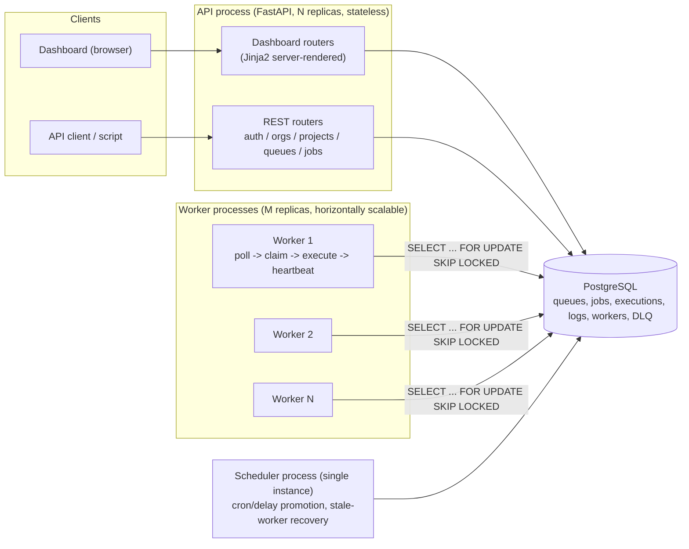
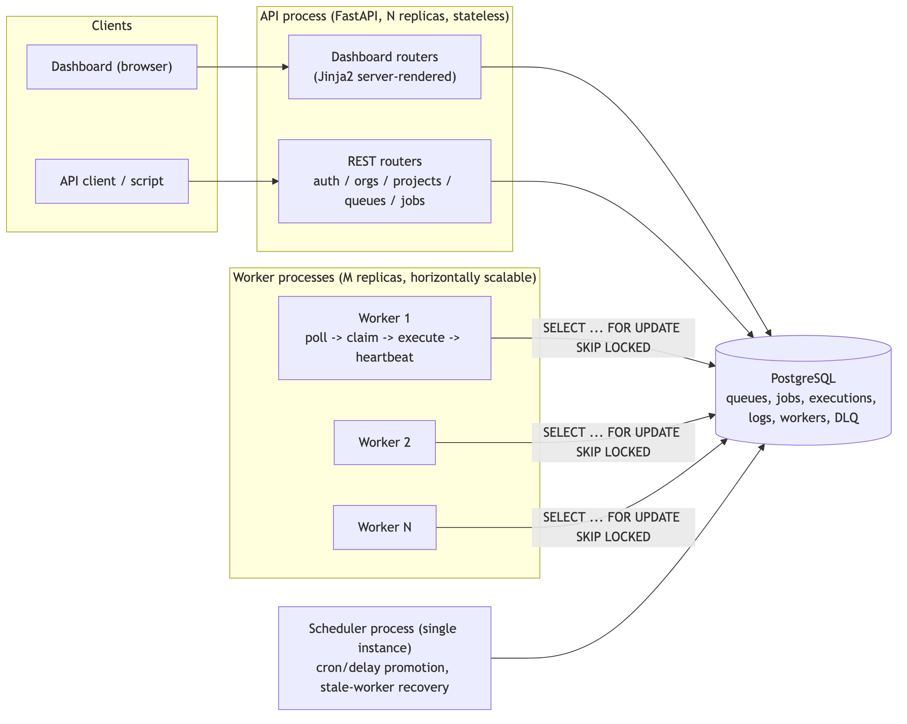
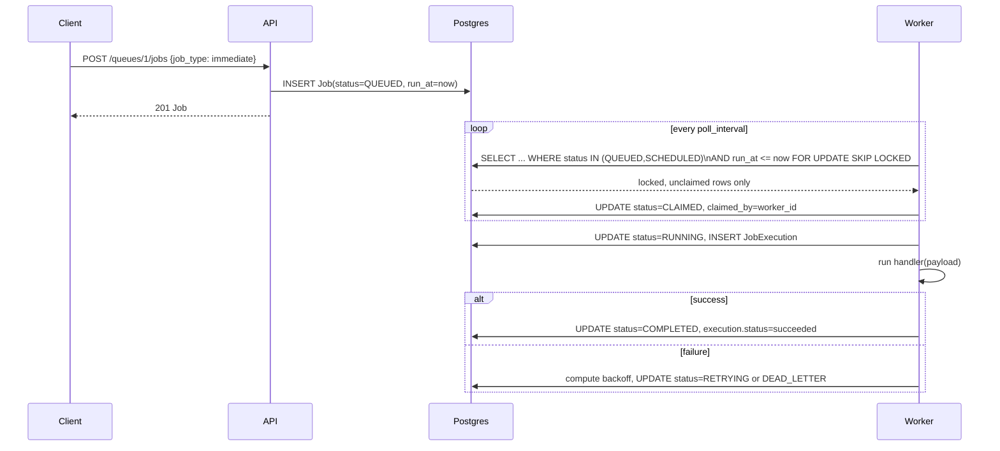
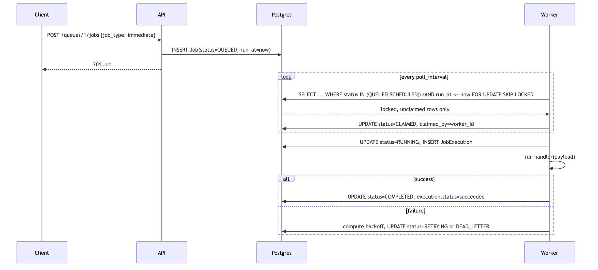

# Architecture

## Components

## Why three process types

- **API process** is stateless and horizontally scalable behind a load
  balancer; it only ever reads/writes Postgres, never talks to workers
  directly. This keeps the system's only shared state in one place, which
  is what makes atomic claiming possible in the first place.
- **Worker processes** are the thing you scale to increase throughput. Each
  is a single Python process running an asyncio loop; add more processes
  (or more machines) to add capacity. They talk to Postgres directly using
  the same SQLAlchemy models as the API (see `docs/DESIGN_DECISIONS.md` for
  why that's a deliberate choice, not an accident).
- **Scheduler** is a single lightweight loop most of the time doing nothing:
  it promotes due `ScheduledJob` definitions into concrete `Job` rows,
  promotes jobs whose retry backoff has elapsed from `RETRYING` back to
  `QUEUED`, and detects workers that have stopped sending heartbeats
  (crash/network partition) and requeues whatever they had claimed. None of
  this is performance-critical, so one instance is enough; if you need HA
  for it, run two behind a Postgres advisory lock (all of its writes are
  already idempotent/guarded with `SKIP LOCKED`, so a brief overlap during
  failover is harmless, just redundant work).

## Job flow (immediate job, happy path)

## Request-path additions (rate limiting, health checks, optional AI calls)

- Every request through the API process passes through a `slowapi`
  rate-limiting middleware; only specific routes carry a limit
  (`/auth/login`, dashboard `/login`, job submission) -- most endpoints are
  unaffected. This is in-process/in-memory, not shared across API
  replicas; acceptable at this project's scale, and called out explicitly
  as a scaling limitation rather than left implicit.
- `/health/live` (no dependencies) and `/health/ready` (checks Postgres)
  are separate on purpose -- a load balancer or orchestrator should route
  on readiness, not liveness, or it'll keep sending traffic to a replica
  whose database connection is down but whose process is still alive.
- The queue detail dashboard page holds a persistent WebSocket connection
  (`/ws/queues/{queue_id}`) rather than the request/response pattern
  everything else in this diagram uses -- the API process re-queries
  Postgres and re-renders a fragment on an interval per open connection,
  pushing to that one client, rather than anything event-driven from the
  worker side. This keeps the worker/API separation intact (no new
  cross-process signaling to build) at the cost of a couple seconds of
  push latency, which is fine for a dashboard a human is watching.
- The AI failure-summary feature is the one place the API process makes
  an *outbound* call to something other than Postgres (the Anthropic API,
  only when a user clicks "Get AI summary" on a dead-lettered job, and
  only if `ANTHROPIC_API_KEY` is configured). It's synchronous from the
  request's perspective and falls back to a local rule-based summary on
  any failure -- see `docs/DESIGN_DECISIONS.md` -- so it never turns an
  external provider outage into a broken dashboard page, and never blocks
  the job lifecycle itself (which has nothing to do with this feature).

## Failure recovery

If a worker crashes mid-job, the DB still shows that job as `CLAIMED` or
`RUNNING` and its heartbeats stop arriving. The scheduler's stale-worker
sweep (`detect_stale_workers`, run every tick) marks the worker `OFFLINE` and
requeues every job it held back to `QUEUED`, so no job is silently lost --
the trade-off is that a crashed-but-still-executing job's side effects could
run twice, which is why job handlers should be idempotent (see
`idempotency_key` on `Job`, and `docs/DESIGN_DECISIONS.md`).
