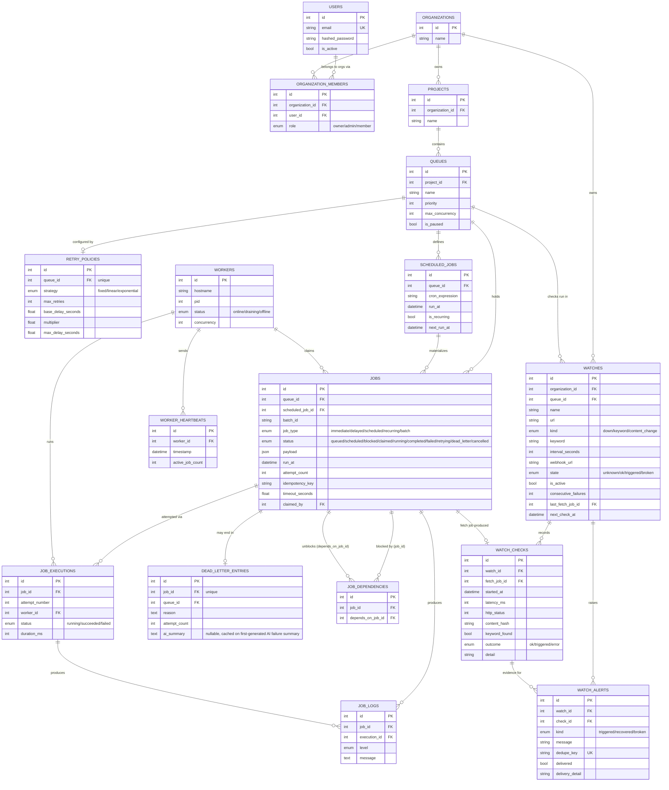
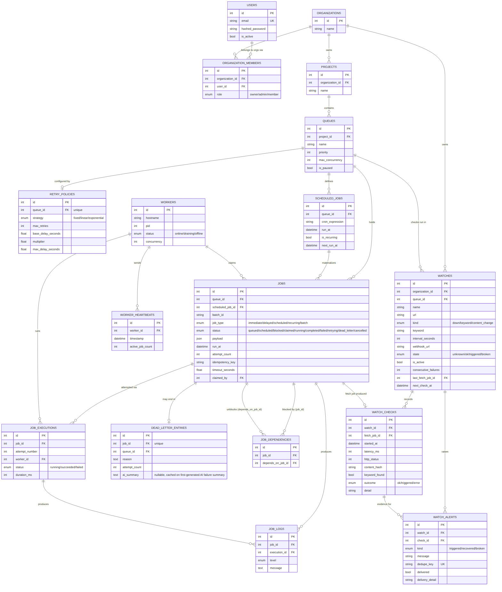

# Entity-Relationship Diagram

## Key design choices

**Primary keys.** Plain autoincrement integers everywhere. Simpler, smaller
indexes, and cheaper joins than UUIDs; nothing here needs to be globally
unique outside the database or generated client-side before insert.

**Cascades.** Ownership cascades all the way down
(`organization → project → queue → job → job_execution/job_log`): deleting a
queue deletes its jobs and their history, because orphaned job rows
referencing a deleted queue are meaningless. `Job.claimed_by → Worker` and
`JobExecution.worker_id → Worker` use `ON DELETE SET NULL` instead --
deleting a worker record shouldn't delete job history, it should just
disassociate it.

**Normalization.** Retry policy is its own table (one-to-one with Queue)
rather than columns bolted onto `Queue`, because jobs can override individual
fields (`max_retries_override`, `retry_strategy_override` on `Job`) and
keeping the "base" policy separate from the override made the fallback logic
in `_effective_retry_params` (see `app/services/job_service.py`) a lot
clearer than juggling nullable columns on two different tables.

**Indexes that matter for correctness/performance, not just uniqueness:**
- `ix_jobs_claim_lookup (queue_id, status, run_at)` — this is the index the
  worker's claim query hits on every poll cycle
  (`WHERE queue_id IN (...) AND status IN (queued, scheduled) AND run_at <=
  now() ORDER BY ... LIMIT n`). Without it, every poll from every worker is a
  full table scan on the busiest table in the system.
- `ix_jobs_idempotency_unique (queue_id, idempotency_key)`, **UNIQUE and
  partial** (`WHERE idempotency_key IS NOT NULL AND status <> 'cancelled'`)
  — this one is a correctness constraint, not just an access path. It's what
  actually enforces idempotent creation: `create_job` does a lookup then an
  insert, and without uniqueness two concurrent requests carrying the same
  key both find nothing and both insert. Partial so that cancelling a job
  frees its key for reuse, and so the index skips the many rows that don't
  use idempotency at all. See migration `0003` and
  `docs/DESIGN_DECISIONS.md` → "Idempotency was claimed but not enforced".
- `ix_scheduled_jobs_next_run (next_run_at)` — the scheduler's due-check
  query.
- `ix_worker_heartbeats_timestamp` — supports trimming/graphing heartbeat
  history without a scan.

**Why `ai_summary` lives on `DeadLetterEntry`, not `Job`.** The
AI-generated failure summary (see `docs/DESIGN_DECISIONS.md`) is only ever
meaningful for a job that's actually dead-lettered -- there's a natural
one-to-one fit with the row that already represents "this job is
permanently failed," rather than adding a nullable column to `Job` that's
meaningless for the other 8 statuses a job can be in.

**Why `Job` and `ScheduledJob` are separate tables** rather than one
self-referential table: a `ScheduledJob` is a *template* that can fire many
times (every occurrence of a cron job creates a new `Job` row linked back via
`scheduled_job_id`); collapsing them would mean overloading one row to mean
both "the definition" and "the most recent occurrence," which made querying
"show me all jobs from this schedule" and "is this schedule still active"
awkward together. Keeping them separate also matches the assignment's
explicit entity list.

## Additions from the watcher pass (2026-08-23)

New tables (included in the diagram above):

- `job_dependencies (job_id, depends_on_job_id)` — directed edges in the
  job DAG; both FKs cascade with the jobs. Unique per edge; indexed both
  directions (children of a job / parents of a job). Paired with the new
  `blocked` value in `job_status` and `jobs.timeout_seconds`.
- `watches` — the user-facing watch definition (org-scoped, kind +
  keyword + interval + optional webhook, state machine
  unknown/ok/triggered/broken, failure streak, link to the last fetch
  job). `next_check_at` is indexed for the scheduler's due-scan.
- `watch_checks` — one row per executed check: latency, HTTP status,
  normalized content hash, keyword hit, outcome. Indexed by
  `(watch_id, started_at)` for the history/chart queries.
- `watch_alerts` — transition alerts; `dedupe_key` is UNIQUE, which is
  what makes alerting idempotent under retries and races. Delivery state
  (`delivered`, `delivery_detail`) lives here so the notify job can catch
  up on undelivered alerts.
